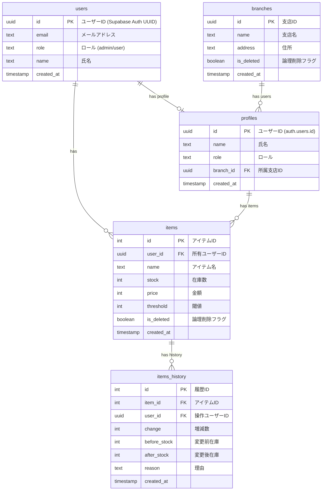

# ER図（Mermaid）

---

- users: Supabase Authユーザー情報（UUID主キー）
- branches: 支店情報（UUID主キー、論理削除対応）
- profiles: アプリ用ユーザープロファイル（auth.users.idを参照、branch_idで支店紐付け）

- items: 在庫アイテム情報（user_idでprofilesと紐付け、stock/threshold/論理削除対応）
- items_history: 在庫数増減履歴（item_id, user_id, change, before/after, reason, created_at）
- RLS: 各テーブルでロール・所有者・論理削除等に応じたアクセス制御（items_historyもuser_id=auth.uid()でRLS）

---

## ROLE（ロール）について

- `profiles.role` カラムでユーザーの権限を管理します。
  - `admin`: 全データ参照・管理可能
  - `user`: 自分のデータのみ参照・操作可能
- API・DB（RLS）両方でロール判定を行い、アクセス制御を実現しています。
- ロールは今後の拡張で追加可能です。

---

## RLS（Row Level Security）設計概要

- branches: 管理者のみ全件操作可、userは自分の所属支店のみ参照可
- profiles: 管理者のみ全件操作可、userは自分のプロフィールのみ参照・編集可
- items: userは自分のuser_idのみ参照可、adminは全件参照可
- items_history: userは自分のuser_idのみ参照可、adminは全件参照可（uuid型で統一）

