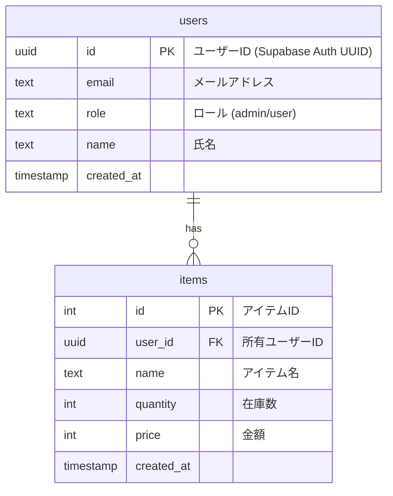

# ER図（Mermaid）

- users: Supabase Authユーザー情報（UUID主キー）
- items: 在庫アイテム情報（user_idでusersと紐付け）
- RLS: items.user_idでアクセス制御

---

## ROLE（ロール）について

- `users.role` カラムでユーザーの権限を管理します。
  - `admin`: 全データ参照・管理可能
  - `user`: 自分のデータのみ参照・操作可能
- API・DB（RLS）両方でロール判定を行い、アクセス制御を実現しています。
- ロールは今後の拡張で追加可能です。
