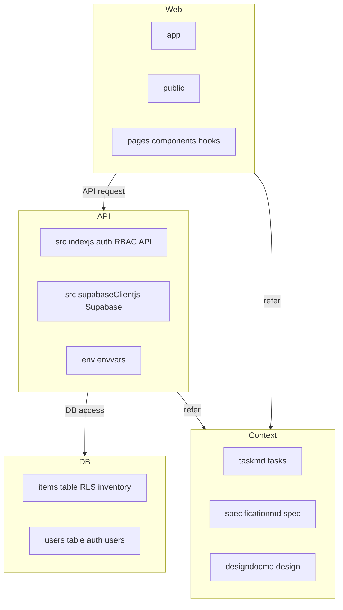

# System Architecture (Mermaid)

```mermaid
flowchart TD
  subgraph Web
    A1[app]
    A2[public]
    A3[pages components hooks]
  end

  subgraph API
    B1[src indexjs auth RBAC API]
    B2[src supabaseClientjs Supabase]
    B3[env envvars]
  end

  subgraph Context
    C1[taskmd tasks]
    C2[specificationmd spec]
    C3[designdocmd design]
  end

  subgraph DB
    D1[items table RLS inventory]
    D2[users table auth users]
  end

  Web -->|API request| API
  API -->|DB access| DB
  API -->|refer| Context
  Web -->|refer| Context
```

---

- Web: Next.js (PWA) frontend
- API: Node.js/Express, JWT auth, RBAC, Supabase
- Context: Requirements/design docs
- DB: Supabase/PostgreSQL, RLS
