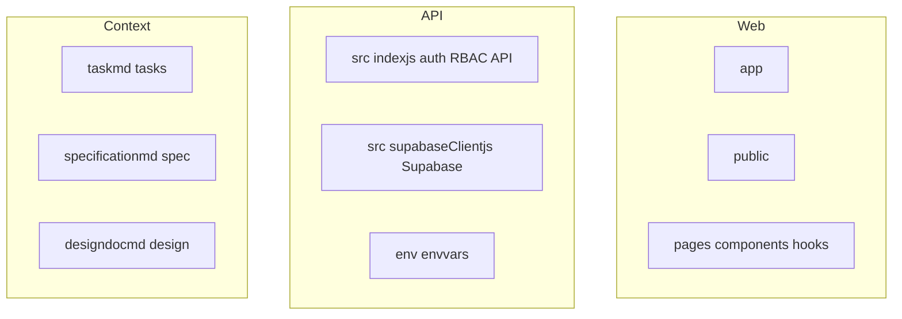
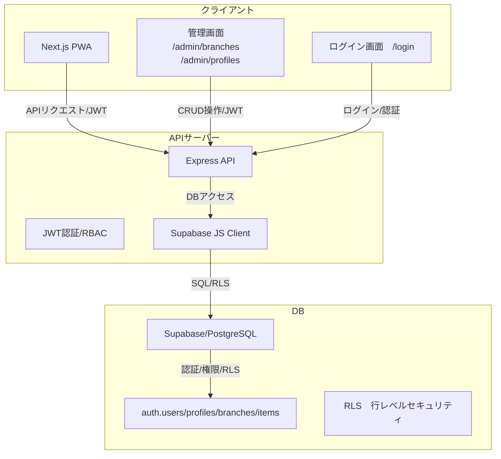

# System Architecture (Mermaid)

---

## システム構成図

---

## 構成要素
- クライアント: Next.js (PWA, app router)
- 管理画面: /admin/branches, /admin/profiles, /login
- APIサーバー: Node.js/Express, JWT認証, RBAC, Supabase JS Client
- DB: Supabase/PostgreSQL, RLS, auth.users, branches, profiles, items

---

## データフロー
1. クライアントでログイン（/login）
2. JWTトークンをlocalStorageに保存
3. APIサーバーへリクエスト時にJWTを付与
4. APIサーバーで認証・RBAC判定
5. Supabase DBへアクセス（RLS有効）
6. クライアントで管理画面（支店・ユーザー管理）操作

---

## 認証・権限
- JWTトークンにrole, user_idを含める
- RBAC: APIサーバーでrole判定
- RLS: DBでuser_id/role/branch_idによる制御

※補足
- JWTトークンはlocalStorage保存時・取得時に正規表現で形式チェック（サニタイズ）を実装し、不正な値は保存・利用しない
- XSS対策として、トークン値のUI出力やdangerouslySetInnerHTML等は利用しない

---

## 管理画面
- /admin/branches: 支店管理（CRUD）
- /admin/profiles: ユーザー管理（CRUD）
- /login: ログイン画面（JWT保存）

---

## DB連携
- Supabase JS ClientでAPIサーバーからDB操作
- RLS有効化、adminは全件、userは自分のbranch_id/ユーザーのみ参照可
